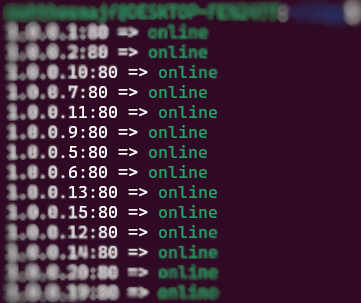

# iSpy
## Screenshot

## About
iSpy is a small IPv4 scanner that allows you to scan for open ports. Features include pretty much everything you'd expect from an IP address scanner, including multithreading support with the ability to scan around a hundred ports at once, although here are some features that are planned to be added:
* Proxy support & TOR support. Some people may want to scan IP addresses secretly, hence the name iSpy. Therefore, it is planned that iSpy will have proxy & TOR support in the future.
## Building
You'll need a UNIX-like operating system, a C compiler, and a libc that supports TCP sockets. Most likely, you have the last two of the requirements. Oh and yes, you'll also need BSD make or GNU make to be able to execute the makefile. Once all the requirements are met, go ahead and run the command `make` in the root directory of the `iSpy` directory.
## Deploying
Refer to **Usage** to figure out how to use it. More detailed documentation will appear here soon.
## Usage
To get started, you can't just run `ispy` without any arguments. You must supply it with the IP address range using the parameters `-0` and `-1`. You must also provide the port that the scanner must scan for, using the `-p` parameter (set it to `80` or `8080` if you are looking for websites, or `25565` for Minecraft servers). You'll DEFINENTLY want to pass the `-t` parameter, since running iSpy with just one thread is extremely slow (the more threads, the faster and more IPv4 addresses will be scanned). You'll also want to set the `-T` parameter, which represents the timeout. We recommend setting it to around `1` or `2`, the more, the slower the scanning will be. An optional but recommended parameter to set is `-l`, which allows you to specify a file to where found hosts should be dumped into (if the file doesn't exist, it will be created). Here's a quick example scanning for "hidden" websites:
```sh
./ispy -t 100 -T 1 -0 1.0.0.0 -1 126.255.255.255 -p 80 -l found_servers.txt
```
## License
I'm still thinking on what license I should place in this project, but for now while I decide it's licensed as All Rights Reserved.